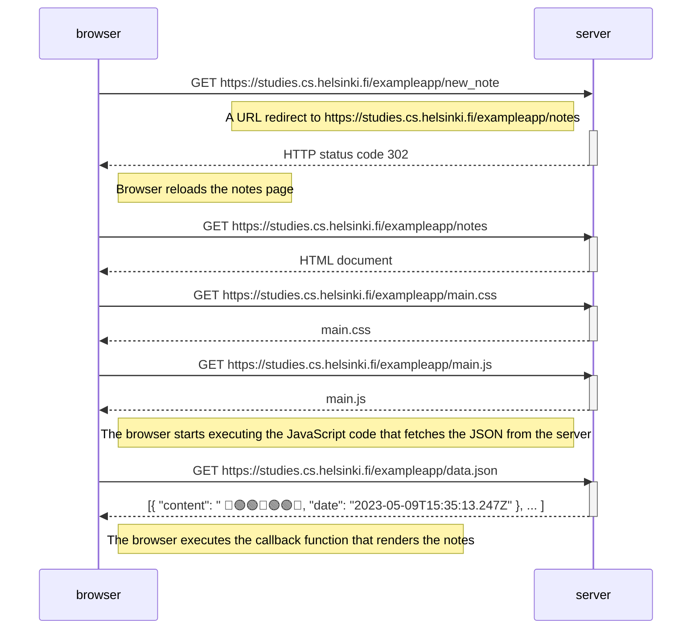

```mermaid
sequenceDiagram
    participant browser
    participant server

    browser->>server: GET https://studies.cs.helsinki.fi/exampleapp/new_note
    Note left of server: A URL redirect to https://studies.cs.helsinki.fi/exampleapp/notes  
    activate server
    server-->>browser: HTTP status code 302
    deactivate server
    Note right of browser: Browser reloads the notes page

    browser->>server: GET https://studies.cs.helsinki.fi/exampleapp/notes
    activate server
    server-->>browser: HTML document
    deactivate server

    browser->>server: GET https://studies.cs.helsinki.fi/exampleapp/main.css
    activate server
    server-->>browser: main.css
    deactivate server

    browser->>server: GET https://studies.cs.helsinki.fi/exampleapp/main.js
    activate server
    server-->>browser: main.js
    deactivate server

    Note right of browser: The browser starts executing the JavaScript code that fetches the JSON from the server

    browser->>server: GET https://studies.cs.helsinki.fi/exampleapp/data.json
    activate server
    server-->>browser: [{ "content": " 🫲🟢🟢😀🟢🟢🫱, "date": "2023-05-09T15:35:13.247Z" }, ... ]
    deactivate server

    Note right of browser: The browser executes the callback function that renders the notes
```